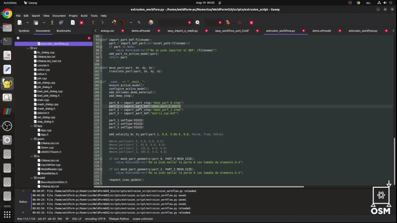
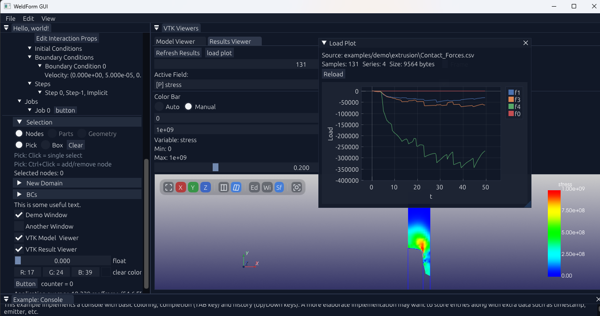
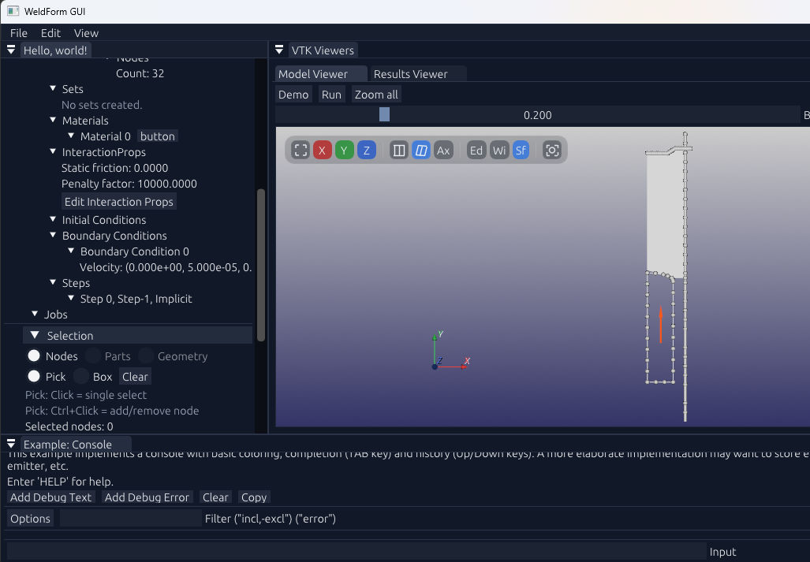
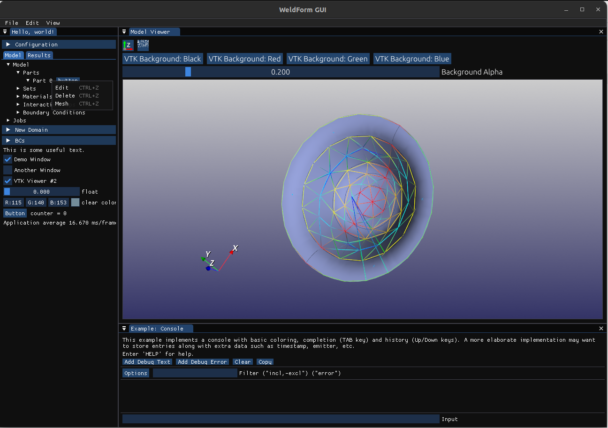
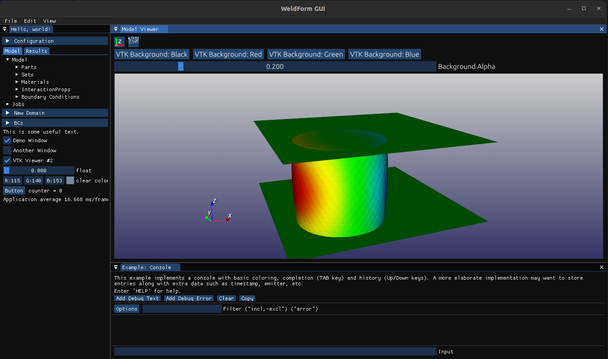
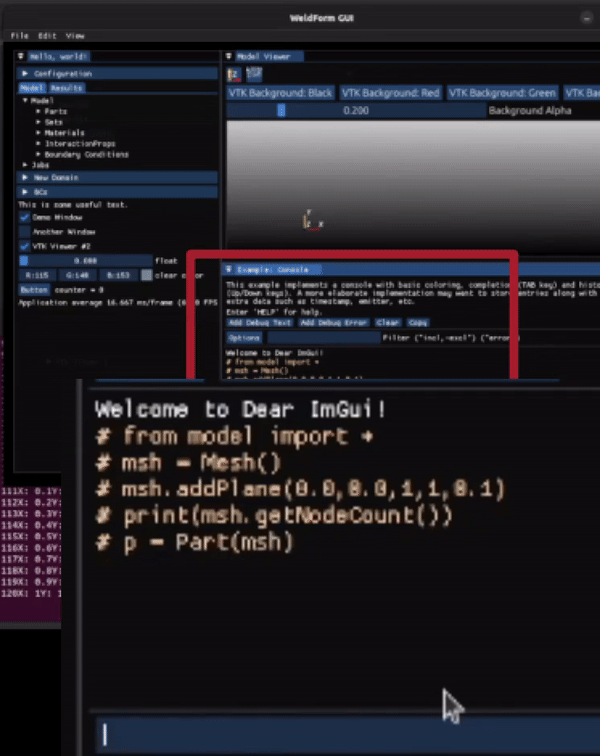

# WeldFormGUI

<!-- Logo placeholder -->
<!--  -->



Lightweight programmable FEM workflow platform.

- Geometry creation and STEP import
- Meshing with Gmsh and custom 2D workflows
- Python-driven model building and automation
- Integrated explicit and implicit solver workflows
- Postprocessing, animation and visualization tools

## Documentation

- [Installation](docs/Install.md)
- [Code Guidelines](docs/README_CODE.md)
- [User Guide](docs/UsersGuide.md)
- [Architecture](docs/WeldFormGUI_Architecture.md)
- [Devlog](docs/DEVLOG.txt)


# Downloads

Student demo binaries for Windows are available here:

[Download WeldFormGUI v0.0.8](https://github.com/luchete80/WeldFormGUI/releases/tag/v0.0.8)

Current demo release includes:
- integrated GUI workflow,
- explicit and implicit student solvers,
- demo projects,
- preprocessing and postprocessing workflow,
- animated result visualization.

The goal of this release is to provide a complete end-to-end FEM workflow experience for educational and research purposes inside a unified workflow focused on nonlinear large deformation problems.









---

# Current Features

## Geometry & CAD
- STEP import
- Primitive geometry creation
- Interactive geometry manipulation
- OpenCASCADE integration

## Meshing
- Integrated meshing workflow
- Custom quad mesher for 2D deformable analyses
- Gmsh integration
- Automatic mesh loading into the project
- 2D and 3D support

## Simulation Workflow
- Integrated explicit and implicit student solvers
- Run directly from the GUI
- Automatic input generation
- Built-in demo workflows
- Live job logs
- Progress bars for runs and result loading

## Solver Selection

- Explicit vs implicit is decided by the active `Step` and exported into the job input file.
- Solver edition is resolved at runtime as `Auto`, `Student`, or `Full`.
- Each job can override solver edition from the Job dialog.
- If a job is left in `Auto`, the application falls back to environment variables and available binaries in `solvers/`.

Environment variables:

```bash
export WELDFORM_SOLVER_EDITION=full   # auto | std | student | full
export WELDFORM_STD_NODE_LIMIT=500
export WELDFORM_STD_ALLOW_THERMAL=0
```

Helper files:

```bash
source scripts/use_solver_full.sh
source scripts/use_solver_std.sh
```

Base template:
- `.env.example`

Resolution order:
- job override from the GUI
- `WELDFORM_SOLVER_EDITION` when the job is `Auto`
- automatic detection of `solvers/weldform_exp`, `solvers/weldform_imp`, or their `_std` variants

Typical setups:
- Development machine with full solvers installed:
  `WELDFORM_SOLVER_EDITION=full`
- Student/release install:
  `WELDFORM_SOLVER_EDITION=std`

## Postprocessing
- Animated results visualization
- Scalar field visualization
- Node and vector display
- Manual and automatic color scaling
- Integrated plots using ImPlot

## Scripting
- Python scripting support through SWIG bindings
- Geometry and mesh manipulation from Python

---

# Build Instructions

## Ubuntu

```bash
sudo apt-get install xorg-dev libglu1-mesa-dev
